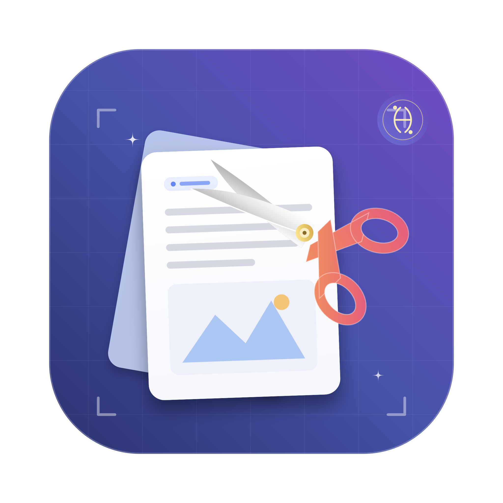

<p align="center">
  
</p>

<h1 align="center">Pastecap</h1>

<p align="center">
  <strong>轻巧纯粹的 macOS 原生剪贴板历史与强大区域截图工具</strong><br>
  原生 Swift & SwiftUI 构建 · 极速响应 · 数据本地保存 · 深浅色无缝自适应
</p>

<p align="center">
  
  
  
</p>

---

## 📸 应用预览与主要截图

<p align="center">
  
</p>

---

## ✨ 核心功能亮点

### 📋 1. 现代优雅的剪贴板管理 (Clipboard History)
- **卡片式精致排版**：自适应深浅色模式（Dark / Light Mode），搭配细腻磨砂玻璃背景与微光悬停质感。
- **智能内容识别**：
  - 🔗 **链接识别**：自动标记并以等宽代码字体高亮。
  - 🎨 **HEX 颜色**：自动解析 `#HEX` 颜色值，并内嵌实时颜色圆点预览。
  - 📝 **多行文本与代码**：智能显示行数与字符数角标，舒适自然换行排版。
  - 🖼️ **图片与截图**：高质量居中缩略图，智能标注图片格式与文件大小。
- **分类筛选胶囊栏**：一键在 `全部`、`文本`、`图片` 之间无缝切换，并支持毫秒级混合关键词搜索。
- **轻量零抖动复制**：点击整行即刻复制并回车，附带卡片微光脉冲反馈。

---

### ✂️ 2. 像素级微信风格区域截图与屏幕贴图 (Screen Capture & Pin)
- **自由选区与八向手柄调整**：选区创建后支持拖拽内部整体移动、拖动 8 个控点精细缩放微调（对角智能切换双向箭头光标）。
- **放大镜与 RGB 取色器**：拖动选区时实时展示 4x 放大镜、选区尺寸与当前像素点的十六进制 HEX 颜色。
- **📌 屏幕贴图 / 大头针置顶 (Pin to Screen)**：一键将截图无缝转化为桌面最上层置顶悬浮窗，任意位置可拖拽，双击或 <kbd>Esc</kbd> 快速关闭，支持右键复制或保存。
- **丰富标注工具箱**：
  - 🔲 矩形 (<kbd>R</kbd>) / ⭕ 椭圆 (<kbd>O</kbd>) / ↗️ 箭头 (<kbd>A</kbd>) / ✏️ 自由画笔 (<kbd>P</kbd>) / 🏁 像素马赛克 (<kbd>M</kbd>) / 🔤 纯净文字标注 (<kbd>T</kbd>)。
- **沉浸式文本输入**：无多余边框干扰，支持小号/中号/大号字阶切换，光标颜色与当前选中色实时同步。
- **键盘流高效闭环**：<kbd>↵ Enter</kbd> 复制完成，<kbd>F</kbd> / <kbd>⌘P</kbd> 钉在屏幕上，<kbd>⌘Z</kbd> 撤销上一笔，<kbd>⌘S</kbd> 保存到文件，<kbd>⎋ Esc</kbd> 随时取消退出。

---

### 🔒 3. 隐私保护与本地安全
- **零网络上传**：所有剪贴板历史与图片均保存在本地 `~/Library/Application Support/Pastecap`。
- **机密数据保护**：1Password、Bitwarden、KeePass 等密码管理器标记为 `Concealed` 或 `Transient` 的敏感复制内容**绝不记录**。

---

## 💻 安装要求

- **操作系统**：macOS 14.0（Sonoma）或更高版本。
- **处理器**：当前 Releases 提供的 `Pastecap.dmg` 为 Apple Silicon（`arm64`）构建，适用于 M1 及更新的 Apple 芯片 Mac；Intel Mac 暂无预编译安装包。
- **屏幕录制权限**：剪贴板历史无需额外权限；区域截图首次使用时，需要在「系统设置 › 隐私与安全性 › 屏幕录制」中允许 Pastecap。
- **网络与账号**：不需要网络连接或账号，剪贴板历史和截图均保存在本机。

### 安装方式

打开 Release 中的 `Pastecap.dmg`，将 **Pastecap** 拖入 **Applications** 文件夹即可。当前安装包使用 ad-hoc 签名（未经过 Apple 公证）；首次打开若提示“无法验证开发者”，请按住 Control 点按应用并选择「打开」，或在「系统设置 › 隐私与安全性」中允许打开。

## ⌨️ 默认快捷键

| 功能 | 默认快捷键 | 说明 |
| :--- | :--- | :--- |
| **打开剪贴板** | <kbd>⇧ Shift</kbd> + <kbd>⌘ Cmd</kbd> + <kbd>V</kbd> | 呼出/隐藏剪贴板主窗口 |
| **区域截图** | <kbd>⌥ Option</kbd> + <kbd>⌘ Cmd</kbd> + <kbd>A</kbd> | 立即进入全屏选区截图模式 |
| **完成并复制** | <kbd>↵ Enter</kbd> / <kbd>⌘ Cmd</kbd> + <kbd>C</kbd> | 截图完成后复制到剪贴板 |
| **钉在屏幕上 (贴图)** | <kbd>F</kbd> / <kbd>⌘ Cmd</kbd> + <kbd>P</kbd> | 截图区域转为最上层置顶悬浮窗 |
| **取消截图** | <kbd>⎋ Esc</kbd> | 退出截图或放弃当前文本输入 |

*(支持在「偏好设置 › 快捷键」中一键自定义修改)*

---

## 📦 编译与打包

```sh
# 本地编译调试
swift build

# 执行全部自动化测试 (60 项断言)
./scripts/run-tests.sh

# 构建生成 Release 安装包 (dist/Pastecap.dmg)
./scripts/build-dmg.sh
```

---

## 🚀 GitHub Release 自动发布

向仓库推送一个 `v*` 格式的 tag，GitHub Actions 会自动编译 `Pastecap.dmg` 并挂载发布到 [Releases](https://github.com/nogeo/Pastecap/releases)：

```sh
git tag v1.2.0
git push origin v1.2.0
```

---

## 🛡️ 屏幕录制权限说明 (Screen Recording)

截图功能依赖 macOS 系统的**屏幕录制权限**（系统设置 › 隐私与安全性 › 屏幕录制）。首次启动时如遇权限提示，请勾选允许 Pastecap 访问屏幕录制权限。
